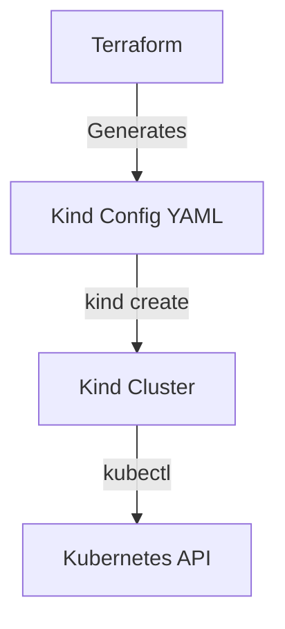

# Terraform Local Kind Cluster
Automates a local Kubernetes Kind cluster using Terraform.

## Purpose
This project demonstrates Infrastructure as Code (IaC) with Terraform to create and manage a local Kubernetes cluster using Kind. It’s ideal for learning Terraform and Kubernetes without cloud dependencies, preparing for AWS-based Cloud Ops roles.

## Prerequisites
- Terraform >= 1.5.0 ([Download](https://www.terraform.io/downloads.html))
- Kind ([Install](https://kind.sigs.k8s.io/docs/user/quick-start/#installation))
- Docker ([Install](https://docs.docker.com/get-docker/))

## Setup
1. Clone the repository:
   ```bash
   git clone https://github.com/subash2021/terraform-local-project.git
   cd terraform-local-project
   ```
2. Initialize Terraform:
   ```bash
   terraform init
   ```

## Usage
1. Preview changes:
   ```bash
   terraform plan
   ```
2. Create the cluster:
   ```bash
   terraform apply
   ```
3. Verify the cluster:
   ```bash
   kubectl cluster-info --context kind-dev-cluster
   ```
4. Clean up:
   ```bash
   terraform destroy
   ```

## Deploying an Application
1. Install Helm: `curl https://raw.githubusercontent.com/helm/helm/main/scripts/get-helm-3 | bash`
2. Add Bitnami repo: `helm repo add bitnami https://charts.bitnami.com/bitnami && helm repo update`
3. Deploy NGINX:
   ```bash
   helm install my-nginx bitnami/nginx --set service.type=ClusterIP --namespace default --kube-context kind-dev-cluster
   ```
4. Access NGINX: `kubectl port-forward svc/my-nginx 8080:80 --namespace default --context kind-dev-cluster` and visit `http://localhost:8080`.

## Outputs
- `kind_config_file`: Path to the generated Kind configuration file (e.g., `terraform-generated-dev-cluster-config.yaml`).
- `kubectl_context`: Kubectl context name (e.g., `kind-dev-cluster`).

## Architecture


## Notes
- Customize the cluster name via `-var="cluster_name=my-cluster"`.
- Requires Kind and Docker to be installed locally.
- Designed to mirror AWS EKS IaC workflows locally.